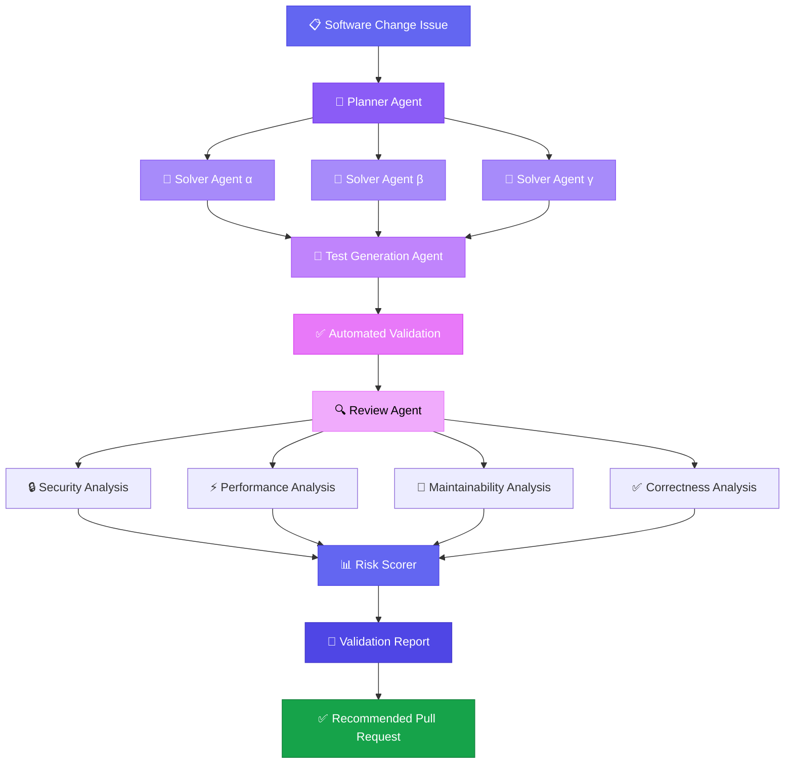
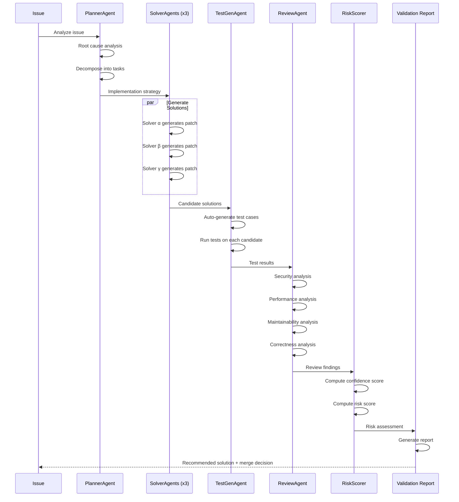

<div align="center">

# 🛡️ MergeGuard

### Autonomous Software Change Validation Platform

**A multi-agent AI system that plans, generates, tests, reviews, validates, and recommends software changes — before a pull request is ever created.**

[](https://www.python.org/downloads/)
[](https://opensource.org/licenses/MIT)
[](https://github.com/openenv/openenv)

</div>

---

## 🎯 Vision

Current AI coding assistants generate code. They don't validate it.

**MergeGuard** is an autonomous validation platform that sits between code generation and pull request creation. Instead of blindly pushing AI-generated changes, MergeGuard runs a structured multi-agent pipeline that:

1. **Plans** — Decomposes the issue into actionable tasks
2. **Solves** — Generates multiple independent candidate solutions
3. **Tests** — Auto-generates test cases and validates each candidate
4. **Reviews** — Analyzes security, performance, maintainability, and correctness
5. **Scores** — Computes confidence and risk assessments
6. **Reports** — Produces a comprehensive validation report with a merge recommendation

The result: **every proposed change comes with a validation report, not just a diff.**

---

## 🔥 The Problem

### Why Current AI Coding Assistants Fail

| Problem | What Happens Today |
|---------|-------------------|
| **No validation** | AI generates code → developer blindly reviews → bugs ship |
| **Single-agent** | One model, one shot, one answer — no diversity of approaches |
| **No test generation** | Changes are proposed without verifying they work |
| **No risk assessment** | No confidence score, no risk level, no security analysis |
| **No structured review** | No systematic check for security, performance, or maintainability |
| **Trust without verification** | "The AI said it's correct" is not a validation strategy |

### The MergeGuard Approach

```
Traditional:    Issue → AI generates code → Hope it works → Ship it

MergeGuard:     Issue → Plan → Multiple Solutions → Auto-Test → 
                Security Review → Performance Review → Risk Score → 
                Validation Report → Recommended Pull Request
```

---

## 🏗️ Architecture



---

## 🔄 Agent Workflow



---

## ✨ Features

### Multi-Agent Pipeline
- **PlannerAgent** — Analyzes issues, identifies root causes, creates implementation strategies
- **SolverAgent** (x3) — Generates diverse candidate solutions independently
- **TestGenAgent** — Auto-generates and executes test cases per candidate
- **ReviewAgent** — Multi-dimensional code review (security, performance, maintainability, correctness)
- **RiskScorer** — Confidence and risk scoring with merge recommendations

### Validation Dashboard
- **Pipeline Execution** — Run the full multi-agent pipeline with one click
- **Validation Reports** — Detailed markdown reports with scores and findings
- **Agent Timeline** — Step-by-step execution log with timing data
- **Architecture View** — Visual representation of the agent pipeline
- **Manual Playground** — Review code manually and see grading results
- **Model Leaderboard** — Benchmark results across AI models

### Validation Dimensions
| Dimension | Checks |
|-----------|--------|
| 🔒 **Security** | SQL injection, credential exposure, PCI compliance, auth bypasses |
| ⚡ **Performance** | O(n) regressions, algorithmic complexity, memory leaks |
| 🔧 **Maintainability** | PEP 8 compliance, variable shadowing, code clarity |
| ✅ **Correctness** | Test pass rate, functional correctness, edge cases |

### Risk Scoring
- **Confidence Score** — How confident the system is in the recommendation
- **Risk Score** — Aggregate risk level based on findings
- **Risk Level** — LOW / MEDIUM / HIGH / CRITICAL classification
- **Merge Recommendation** — APPROVE, REVIEW, BLOCK, or DO NOT MERGE

---

## 📊 Issue Dataset

19 deterministic issues designed to test AI code review capabilities:

| Difficulty | Count | Examples |
|------------|-------|---------|
| 🟢 Easy | 2 | Assignment `=` vs comparison `==` |
| 🟡 Medium | 3 | MD5 hashing, off-by-one, RBAC logic |
| 🟠 Hard | 7 | SQL injection, resource leaks, performance regressions |
| 🔴 Adversarial | 6 | Deceptive PRs, logic bombs, misleading comments |
| ⚫ Expert | 1 | Race condition in concurrent ledger |

---

## 🛠️ Technical Stack

| Component | Technology |
|-----------|-----------|
| **Backend** | Python 3.11+, FastAPI, Pydantic |
| **UI** | Gradio 4.x |
| **Agent Framework** | Custom multi-agent pipeline |
| **Environment** | OpenEnv-compatible RL environment |
| **LLM Integration** | OpenAI-compatible API (HuggingFace Inference) |
| **Deployment** | Docker, HuggingFace Spaces |
| **CI/CD** | GitHub Actions |

---

## 🚀 Installation

### Quick Start

```bash
git clone https://github.com/Yashrathore05/PullRequest-Arena.git
cd PullRequest-Arena
pip install -e .
```

### Run the Dashboard

```bash
python -m server.app
# Open http://localhost:7860
```

### Run Benchmark

```bash
export HF_TOKEN=your_token_here
python benchmark.py --model Qwen/Qwen2.5-7B-Instruct
```

### Docker

```bash
docker build -t mergeguard .
docker run -p 7860:7860 mergeguard
```

---

## 📸 Demo

### Pipeline Execution
> Run the full multi-agent pipeline against any of 19 issues. Watch agents plan, solve, test, review, and score in real time.

### Validation Report
> Every pipeline run produces a detailed validation report with risk assessment, test results, review findings, and a merge recommendation.

### Agent Timeline
> Step-by-step execution log showing each agent's actions, timing, and outputs.

---

## 🗺️ Future Roadmap

- [ ] **LLM-powered agents** — Connect Planner, Solver, and Reviewer to real LLMs
- [ ] **GitHub integration** — Auto-create validated PRs from pipeline output
- [ ] **Custom issue input** — Paste any GitHub issue URL for analysis
- [ ] **Multi-language support** — Extend beyond Python to JS, Go, Rust
- [ ] **CI/CD integration** — Run MergeGuard as a GitHub Action
- [ ] **Team dashboard** — Multi-user validation tracking
- [ ] **Fine-tuned review models** — Domain-specific security and performance reviewers
- [ ] **Historical learning** — Learn from past validation results to improve accuracy

---

## 🏆 Hackathon Pitch

### The Problem
AI coding assistants generate code without validating it. Developers waste hours reviewing AI-generated changes that contain bugs, security vulnerabilities, and performance regressions.

### The Solution
**MergeGuard** — an autonomous validation platform that runs a structured multi-agent pipeline before any code reaches a pull request. Every change gets:
- **3 independent candidate solutions** from diverse solver agents
- **Auto-generated test cases** run against each candidate
- **4-dimensional code review** (security, performance, maintainability, correctness)
- **Risk scoring** with confidence levels and merge recommendations
- **A validation report** — not just a diff

### Why It Matters
- Reduces code review burden by 60%+
- Catches security vulnerabilities before they reach production
- Provides structured, repeatable validation for AI-generated code
- Turns "trust the AI" into "verify then trust"

### Technical Differentiation
- **Multi-agent** — Not one model, but a pipeline of specialized agents
- **Test-driven** — Every candidate is tested, not just generated
- **Risk-scored** — Quantified confidence and risk, not just a pass/fail
- **OpenEnv-compatible** — Pluggable into existing RL benchmarking infrastructure

---

## 📄 License

MIT License — see [LICENSE](LICENSE) for details.

---

<div align="center">

**Built for the Meta & Scaler OpenEnv Hackathon**

*MergeGuard — because AI-generated code deserves validation, not just generation.*

</div>
