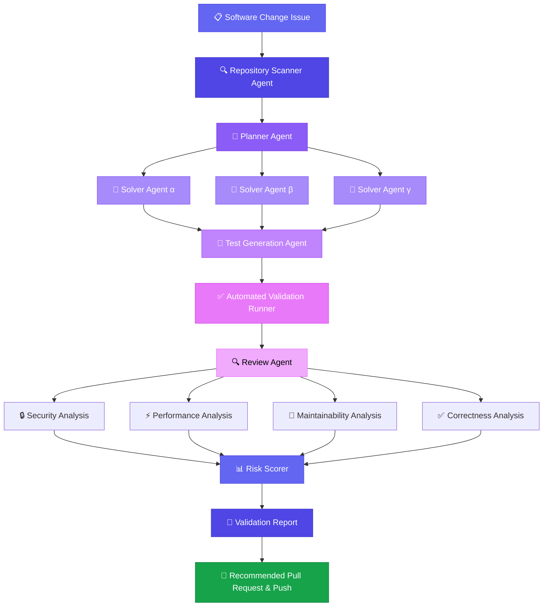
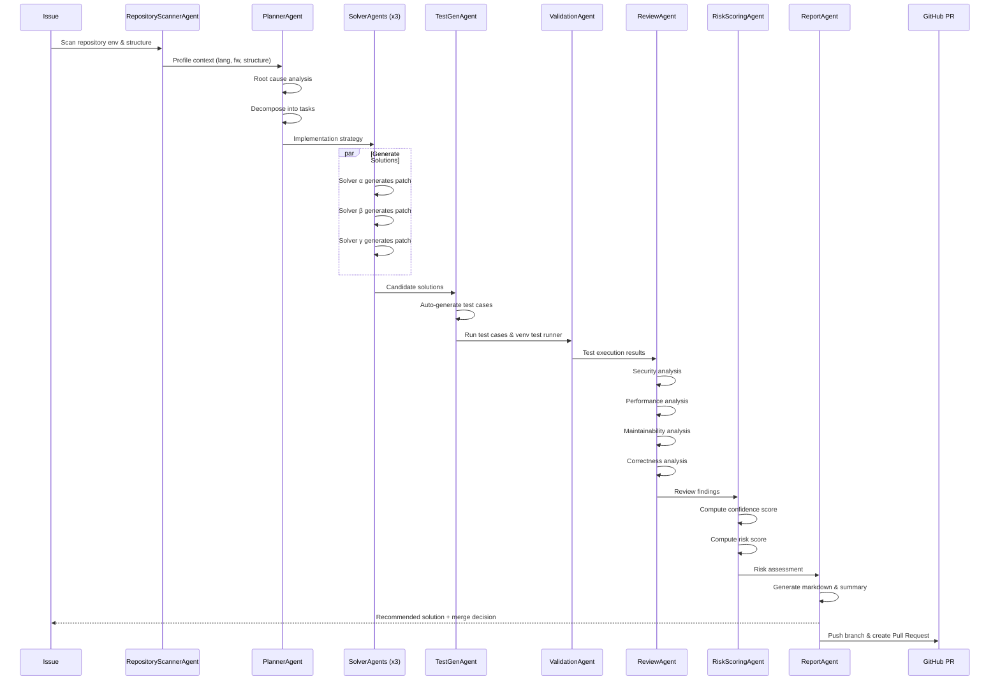

<div align="center">

# 🛡️ PatchGuard AI

### Autonomous Software Change Validation Platform

**A multi-agent AI system that scans repositories, plans, generates, tests, reviews, validates, and recommends software changes — before a pull request is ever created.**

[](https://www.python.org/downloads/)
[](https://opensource.org/licenses/MIT)
[](https://github.com/openenv/openenv)

</div>

---

## 🎯 Vision

Current AI coding assistants generate code. They don't validate it.

**PatchGuard AI** is an autonomous validation platform that sits between code generation and pull request creation. Instead of blindly pushing AI-generated changes, PatchGuard AI runs a structured multi-agent pipeline that:

1. **Scans** — Automatically profiles repository framework, language, package manager, and structure
2. **Plans** — Decomposes the issue into actionable tasks
3. **Solves** — Generates multiple independent candidate solutions
4. **Tests** — Auto-generates test cases and executes actual test runners (pytest, npm test, etc.) in the workspace
5. **Reviews** — Analyzes security, performance, maintainability, and correctness
6. **Scores** — Computes confidence and risk assessments
7. **Reports** — Produces a comprehensive validation report with a merge recommendation and direct GitHub Pull Request creation

The result: **every proposed change comes with a validation report, not just a diff.**

---

## 🔥 The Problem

### Why Current AI Coding Assistants Fail

| Problem | What Happens Today |
|---------|-------------------|
| **No validation** | AI generates code → developer blindly reviews → bugs ship |
| **Single-agent** | One model, one shot, one answer — no diversity of approaches |
| **No test generation** | Changes are proposed without verifying they work |
| **No risk assessment** | No confidence score, no risk level, no security analysis |
| **No structured review** | No systematic check for security, performance, or maintainability |
| **Trust without verification** | "The AI said it's correct" is not a validation strategy |

### The PatchGuard AI Approach

```
Traditional:    Issue → AI generates code → Hope it works → Ship it

PatchGuard AI:  Issue → Scan Repo → Plan → Multiple Solutions → Auto-Test & Real Execution → 
                Security Review → Performance Review → Risk Score → 
                Validation Report → Recommended Pull Request & Git Push
```

---

## 🏗️ Architecture



---

## 🔄 Agent Workflow



---

## ✨ Features

### Multi-Agent Pipeline
- **RepositoryScannerAgent** — Automatically profiles repository metadata, structures, configs, framework and language.
- **PlannerAgent** — Analyzes issues, identifies root causes, creates implementation strategies.
- **SolverAgent** (x3) — Generates diverse candidate solutions independently.
- **TestGenAgent** — Auto-generates test cases per candidate.
- **ValidationAgent** — Runs actual unit/pytest/npm suites in the workspace, with graceful demo simulation fallback.
- **ReviewAgent** — Multi-dimensional code review (security, performance, maintainability, correctness).
- **RiskScoringAgent** — Confidence and risk scoring with merge recommendations.
- **ReportAgent** — Formats validation timeline and details into Markdown.

### Validation Dashboard
- **GitHub Connection** — Input Repository URL and PAT to dynamically load issues and commit branches.
- **Repository Scan Results** — Inspect language, framework, configs, and layout info before execution.
- **Pipeline Execution** — Run the full multi-agent pipeline with one click.
- **Validation Reports** — Detailed markdown reports with scores and findings.
- **Agent Timeline** — Step-by-step execution log with timing data.
- **Pull Request Preview** — Review drafted title, body, and files to push. Directly create Pull Requests.
- **Model Leaderboard** — Benchmark results across AI models.

---

## 📊 Issue Dataset

19 deterministic issues designed to test AI code review capabilities:

| Difficulty | Count | Examples |
|------------|-------|---------|
| 🟢 Easy | 2 | Assignment `=` vs comparison `==` |
| 🟡 Medium | 3 | MD5 hashing, off-by-one, RBAC logic |
| 🟠 Hard | 7 | SQL injection, resource leaks, performance regressions |
| 🔴 Adversarial | 6 | Deceptive PRs, logic bombs, misleading comments |
| ⚫ Expert | 1 | Race condition in concurrent ledger |

---

## 🛠️ Technical Stack

| Component | Technology |
|-----------|-----------|
| **Backend** | Python 3.11+, FastAPI, Pydantic |
| **UI** | Gradio 4.x |
| **Agent Framework** | Custom multi-agent pipeline |
| **Environment** | OpenEnv-compatible RL environment |
| **LLM Integration** | OpenAI-compatible API (HuggingFace Inference) |
| **Deployment** | Docker, HuggingFace Spaces |
| **CI/CD** | GitHub Actions |

---

## 🚀 Installation

### Quick Start

```bash
git clone https://github.com/Yashrathore05/PullRequest-Arena.git
cd PullRequest-Arena
pip install -e .
```

### Run the Dashboard

```bash
python -m server.app
# Open http://localhost:7860
```

### Run Benchmark

```bash
export HF_TOKEN=your_token_here
python benchmark.py --model Qwen/Qwen2.5-7B-Instruct
```

### Docker

```bash
docker build -t patchguard .
docker run -p 7860:7860 patchguard
```

---

## 📄 License

MIT License — see [LICENSE](LICENSE) for details.

---

<div align="center">

**Built for the Meta & Scaler OpenEnv Hackathon**

*PatchGuard AI — because AI-generated code deserves validation, not just generation.*

</div>
